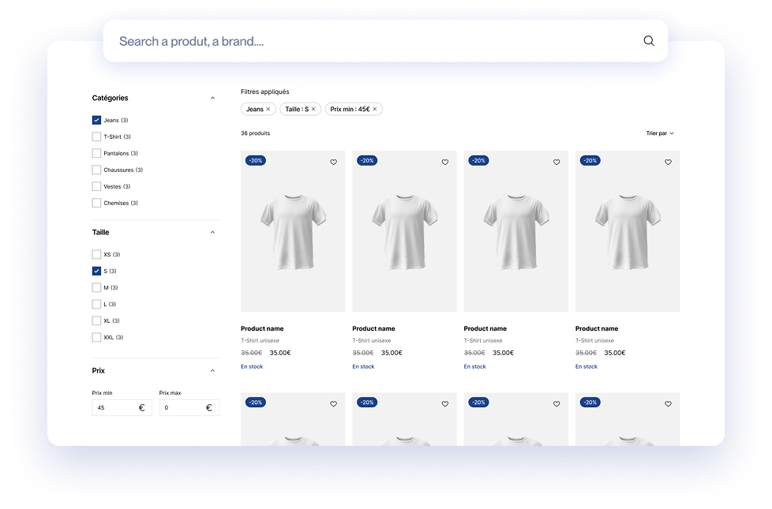

# Mezcalito UX Search

## Overview

The Mezcalito UxSearch Bundle provides an easy-to-use classic search and faceted search system in your Symfony application using Twig Components and Live Components. It allows you to create and manage multiple search, each with its unique configuration. Currently, the bundle supports Doctrine and Meilisearch adapter.

[](https://ux-search.mezcalito.dev/)

[View demo](https://ux-search.mezcalito.dev/demo)


## Installation

Add [mezcalito/ux-search](https://packagist.org/packages/mezcalito/ux-search) to your composer.json file:

```bash
composer require mezcalito/ux-search
```

## Register and configure the bundle

If you are using Symfony Flex, the following steps should be done automatically. Otherwise, follow the instructions.

### Register the bundle

Inside `config/bundles.php`, add the following line:

```php
// config/bundles.php

return [
    // ...
    Mezcalito\UxSearchBundle\MezcalitoUxSearchBundle::class => ['all' => true],
];
```

## Configuration
To configure the bundle, add the following configuration to your `config/packages/mezcalito_ux_search.yaml` file. 
This example demonstrates how to set up a Meiliseach adapter:

```yaml
mezcalito_ux_search:
    default_adapter: 'default'
    adapters:
        default: '%env(MEZCALITO_UX_SEARCH_DEFAULT_DSN)%'
        orm: '%env(MEZCALITO_UX_SEARCH_ORM_DSN)%'
```

### Available adapter

For now, only 2 adapters are available: [Meilisearch](https://www.meilisearch.com) and [Doctrine](https://www.doctrine-project.org/projects/orm.html).

| Adapter     | DSN                              |
|-------------|----------------------------------|
| Meilisearch | meilisearch://key@localhost:7700 |
| Doctrine    | doctrine://default               |


Read the [Meilisearch part](docs/usage/meilisearch.md) docs and the [Doctrine part](docs/usage/doctrine.md) docs to learn about the configuration options available for each adapter.

You can also [create your own Adapter](docs/create-own-adapter.md) to use other provider.

## Usage

To use the bundle, create your first `Search`. To do this, just use the `make:search` command and follow indications.

```bash
php bin/console make:search
```

In the case of Meilisearch, you need to specify the name of the index to use, and for Doctrine, the FQCN of the entity to use.

By default, the name of your search will be the name of your class with the `Search` suffix removed. You can change this by specifying a custom name.

Also, by default, the Adapter used is the one specified in the configuration under `default_adapter`. You can specify the name of the Adapter to use, for example, if you have multiple `Search` instances that use different Adapters.

After that, you have a fully functional simple search.
Feel free to check the documentation to [customize your search](docs/usage/customize-your-search.md) (adding facets, sorting, ...) or if you prefer not to use the maker.


## Render a Search

To render a search in your Twig template, you can use the `Mezcalito:UxSearch:Layout`, you will then have a default rendering provided by the bundle.

### Using compnent function
```twig
{{ component('Mezcalito:UxSearch:Layout', { name: 'listing' }) }}
```

### Using HTML-like Syntax
```twig
<twig:Mezcalito:UxSearch:Layout name="listing"/>
```

In both cases, replace `listing` with the name of search configuration.


### Default layout component
```twig
<div {{ attributes.defaults({
  'class': 'ux-search',
  'data-controller': 'ux-search',
  'data-loading': 'addClass(ux-search--is-loading)'
}) }}>
    
        <div class="ux-search__inner">
            <div class="ux-search__form">
                
                    <twig:Mezcalito:UxSearch:SearchInput />
                
            </div>
        
            <div class="ux-search__toolbar">
                
                    <twig:Mezcalito:UxSearch:CurrentRefinements/>
                    <twig:Mezcalito:UxSearch:ClearRefinements />
                    <twig:Mezcalito:UxSearch:SortBy/>
                
            </div>
        
            <div class="ux-search__facets">
                
                    
                        <twig:Mezcalito:UxSearch:Facet :property="facet.property" />
                    
                
            </div>
        
            <div class="ux-search__listing">
                
                    <div class="ux-search__stats">
                        
                            <twig:Mezcalito:UxSearch:TotalHits/>
                        
                    </div>
            
                    
                        <twig:Mezcalito:UxSearch:Hits />
                    
            
                    
                        <twig:Mezcalito:UxSearch:Pagination />
                    
                
            </div>
        </div>
    
</div>
```

### Customization

You can tailor the behavior and appearance according to your needs by overriding default component or implementing custom logic. This allows you to adapt the bundle to your specific use cases and requirements.

| Component name                                                  | Description                                                                               |
|-----------------------------------------------------------------|-------------------------------------------------------------------------------------------|
| [Layout](docs/components/Layout.md)                             | The root wrapper component for all components                                             |
| [CurrentRefinements](docs/components/CurrentRefinements.md)     | Displays a list of refinements applied to the search                                      |
| [ClearRefinements](docs/components/ClearRefinements.md)         | Displays a button that lets users clean every refinement applied to the search            | 
| [SearchInput](docs/components/SearchInput.md)                   | Let users perform a text-based query                                                      |
| [SortBy](docs/components/SortBy.md)                             | Displays a list of sorting possibility, allowing a user to change the way hits are sorted |
| [TotalHits](docs/components/TotalHits.md)                       | Displays the total number of matching hits                                                |
| [Pagination](docs/components/Pagination.md)                     | Displays a pagination system which lets users change the current page of search results   |
| [Facet/RangeInput](docs/components/Facet/RangeInput.md)         | Allows a user to select a numeric range using a minimum and maximum input.                |
| [Facet/RangeSlider](docs/components/Facet/RangeSlider.md)       | Provides a user-friendly way to filter the results, based on a single numeric range       |
| [Facet/RefinementList](docs/components/Facet/RefinementList.md) | Users can filter the dataset based on facets                                              |
| [Hits](docs/components/Hits.md)                                 | Display a list of results.                                                                |


## Issues and feature requests

Please report issues and request features at https://github.com/mezcalito/ux-search/issues.

## License

This bundle is under the MIT license. For the whole copyright, see the LICENSE file distributed with this source code.
